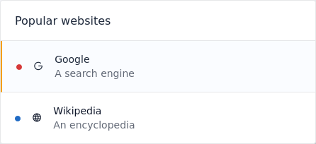
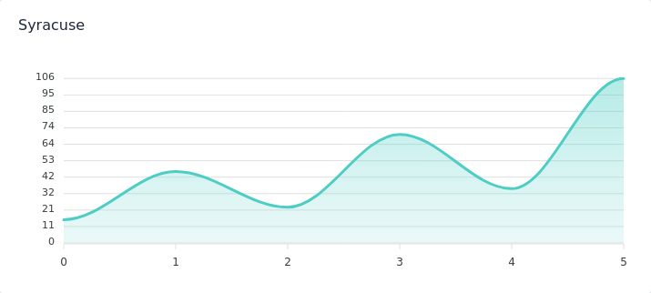
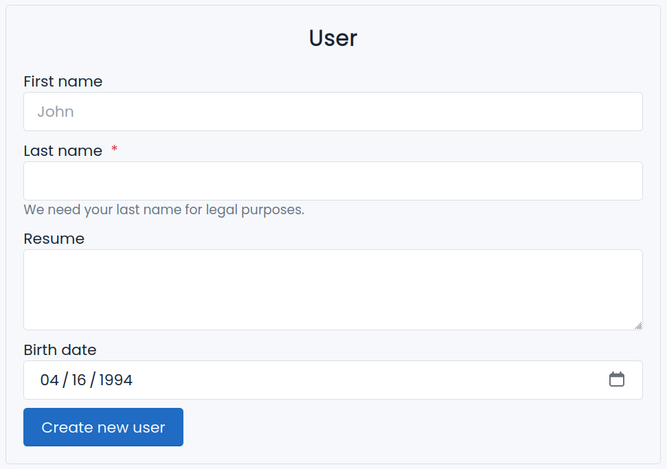
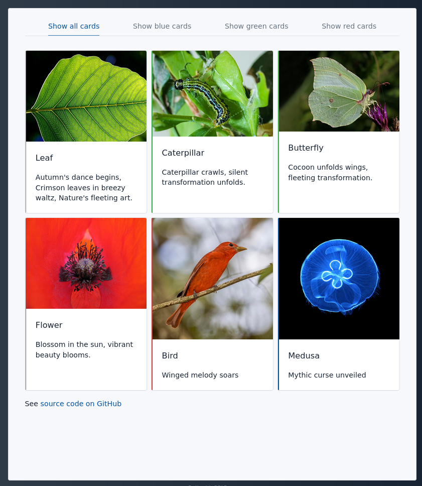
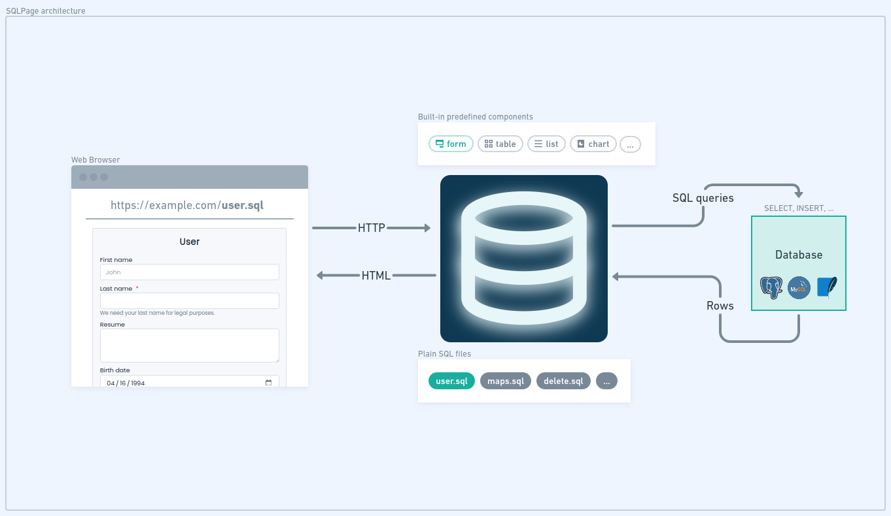

<h1 align="center">
SQLpage
</h1>

[](./docs/sqlpage.mp4)

[SQLpage](https://sql.ophir.dev) is an **SQL**-only webapp builder.
It is meant for data scientists, analysts, and business intelligence teams
to build powerful data-centric applications quickly,
without worrying about any of the traditional web programming languages and concepts.

With SQLPage, you write simple `.sql` files containing queries to your database
to select, group, update, insert, and delete your data, and you get good-looking clean webpages
displaying your data as text, lists, grids, plots, and forms.

## Examples

<table>
<thead>
<tr><td>Code<td>Result</tr>
</thead>
<tbody>
<tr>
<td>

```sql
SELECT 
    'list' as component,
    'Popular websites' as title;
SELECT 
    name as title,
    url as link,
    CASE type
      WHEN 1 THEN 'blue'
      ELSE 'red'
    END as color,
    description, icon, active
FROM website;
```

<td>
    


</tr>
<tr>
<td>

```sql
SELECT
  'chart' as component,
  'Quarterly Revenue' as title,
  'area' as type;

SELECT
    quarter AS x,
    SUM(revenue) AS y
FROM finances
GROUP BY quarter
```

<td>



</tr>
<tr>
<td>

```sql
SELECT
    'form' as component,
    'User' as title,
    'Create new user' as validate;

SELECT
    name, type, placeholder,
    required, description
FROM user_form;

INSERT INTO user
SELECT $first_name, $last_name, $birth_date
WHERE $first_name IS NOT NULL;
```

<td>



</tr>
<tr>
<td>

```sql
select 'tab' as component, true as center;
select 'Show all cards' as title, '?' as link,
  $tab is null as active;
select
  format('Show %s cards', color) as title,
  format('?tab=%s', color) as link,
  $tab=color as active
from tab_example_cards
group by color; 


select 'card' as component;
select
  title, description, color
  image_url as top_image, link
from tab_example_cards
where $tab is null or $tab = color;

select
  'text' as component,
  sqlpage.read_file_as_text('footer.md') as contents_md
```

<td>



</tr>
</tbody>
</table>

## Supported databases

- [SQLite](https://www.sqlite.org/index.html), including the ability to [load extensions](./configuration.md) such as *Spatialite*.
- [PostgreSQL](https://www.postgresql.org/), and other compatible databases such as *YugabyteDB*, *CockroachDB* and *Aurora*.
- [MySQL](https://www.mysql.com/), and other compatible databases such as *MariaDB* and *TiDB*.
- [Microsoft SQL Server](https://www.microsoft.com/en-us/sql-server), and all compatible databases and providers such as *Azure SQL* and *Amazon RDS*.

## How it works



SQLPage is a [web server](https://en.wikipedia.org/wiki/Web_server) written in
[rust](https://en.wikipedia.org/wiki/Rust_(programming_language))
and distributed as a single executable file.
When it receives a request to a URL ending in `.sql`, it finds the corresponding
SQL file, runs it on the database,
passing it information from the web request as SQL statement parameters.
When the database starts returning rows for the query,
SQLPage maps each piece of information in the row to a parameter
in one of its pre-defined components' templates, and streams the result back
to the user's browser.

## Get started

[Read the official *get started* guide on SQLPage's website](https://sql.ophir.dev/get_started.sql).

### Using executables

The easiest way to get started is to download the latest release from the
[releases page](https://github.com/lovasoa/SQLpage/releases).

- Download the binary that corresponds to your operating system (linux, macos, or windows).
- Uncompress it: `tar -xzf sqlpage-*.tgz`
- Run it: `./sqlpage.bin`

### With docker

To run on a server, you can use [the docker image](https://hub.docker.com/r/lovasoa/sqlpage):

- [Install docker](https://docs.docker.com/get-docker/)
- In a terminal, run the following command:
  - `docker run -it --name sqlpage -p 8080:8080 --volume "$(pwd):/var/www" --rm lovasoa/sqlpage`
  - (`"$(pwd):/var/www"` allows sqlpage to run sql files from your current working directory)
- Create a file called index.sql with the contents from [this example](./index.sql)
- Open https://localhost:8080 in your browser
- Optionally, you can also mount a directory containing sqlpage's configuration file,
  custom components, and migrations
  (see [configuration.md](./configuration.md)) to `/etc/sqlpage` in the container.
     - For instance, you can use:
       - `docker run -it --name sqlpage -p 8080:8080 --volume "$(pwd)/source:/var/www" --volume "$(pwd)/configuration:/etc/sqlpage:ro" --rm lovasoa/sqlpage`
     - And place your website in a folder named `source` and your `sqlpage.json` in a folder named `configuration`.
- If you want to build your own docker image, taking the raw sqlpage image as a base is not recommended, since it is extremely stripped down and probably won't contain the dependencies you need. Instead, you can take debian as a base and simply copy the sqlpage binary from the official image to your own image:
  - ```Dockerfile
    FROM debian:stable-slim
    COPY --from=lovasoa/sqlpage:main /usr/local/bin/sqlpage /usr/local/bin/sqlpage
    ``` 

### On Mac OS, with homebrew

An alternative for Mac OS users is to use [SQLPage's homebrew package](https://formulae.brew.sh/formula/sqlpage).

- [Install homebrew](https://brew.sh/)
- In a terminal, run the following commands:
  - `brew install sqlpage`


## Examples

 - [TODO list](./examples/todo%20application/): a simple todo list application, illustrating how to create a basic CRUD application with SQLPage.
- [Plots, Tables, forms, and interactivity](./examples/plots%20tables%20and%20forms/): a short well-commented demo showing how to use plots, tables, forms, and interactivity to filter data based on an URL parameter.
- [Tiny splitwise clone](./examples/splitwise): a shared expense tracker app
- [Corporate Conundrum](./examples/corporate-conundrum/): a board game implemented in SQL
- [Master-Detail Forms](./examples/master-detail-forms/): shows how to implement a simple set of forms to insert data into database tables that have a one-to-many relationship.
- [SQLPage's own official website and documentation](./examples/official-site/): The SQL source code for the project's official site, https://sql.ophir.dev
- [Image gallery](./examples/image%20gallery%20with%20user%20uploads/): An image gallery where users can log in and upload images. Illustrates the implementation of a user authentication system using session cookies, and the handling of file uploads.
- [User Management](./examples/user-authentication/): An authentication demo with user registration, log in, log out, and confidential pages. Uses PostgreSQL.
- [Making a JSON API and integrating React components in the frontend](./examples/using%20react%20and%20other%20custom%20scripts%20and%20styles/): Shows how to integrate a react component in a SQLPage website, and how to easily build a REST API with SQLPage.
- [Handling file uploads](./examples/image%20gallery%20with%20user%20uploads): An image gallery where authenticated users can publish new images via an upload form.
- [Bulk data import from CSV files](./examples/official-site/examples/handle_csv_upload.sql) : A simple form letting users import CSV files to fill a database table.
- [Advanced authentication example using PostgreSQL stored procedures](https://github.com/mnesarco/sqlpage_auth_example)
- [Complex web application in SQLite with user management, file uploads, plots, maps, tables, menus, ...](https://github.com/DSMejantel/Ecole_inclusive)
- [Single sign-on](./examples/single%20sign%20on): An example of how to implement OAuth and OpenID Connect (OIDC) authentication in SQLPage. The demo also includes a CAS (Central Authentication Service) client.

You can try all the examples online without installing anything on your computer using [SQLPage's online demo on replit](https://replit.com/@pimaj62145/SQLPage).

## Configuration

SQLPage can be configured through either a configuration file placed in `sqlpage/sqlpage.json`
or environment variables such as `DATABASE_URL` or `LISTEN_ON`.

For more information, read [`configuration.md`](./configuration.md).

Additionally, custom components can be created by placing [`.handlebars`](https://handlebarsjs.com/guide/)
files in `sqlpage/templates`. [Example](./sqlpage/templates/card.handlebars).

### HTTPS

SQLPage supports HTTP/2 and HTTPS natively and transparently.
Just set `SQLPAGE_HTTPS_DOMAIN=example.com`, and SQLPage
will automatically request a trusted certificate and
start encrypting all your user's traffic with it.
No tedious manual configuration for you,
and no annoying "Connection is Not Secure" messages for your users !

## Serverless

You can run SQLpage [serverless](https://en.wikipedia.org/wiki/Serverless_computing)
by compiling it to an [AWS Lambda function](https://aws.amazon.com/lambda/).
An easy way to do so is using the provided docker image:

```bash
 docker build -t sqlpage-lambda-builder . -f lambda.Dockerfile --target builder
 docker run sqlpage-lambda-builder cat deploy.zip > sqlpage-aws-lambda.zip
```

You can then just add your own SQL files to `sqlpage-aws-lambda.zip`,
and [upload it to AWS Lambda](https://docs.aws.amazon.com/lambda/latest/dg/gettingstarted-package.html#gettingstarted-package-zip),
selecting *Custom runtime on Amazon Linux 2* as a runtime.

### Hosting sql files directly inside the database

When running serverless, you can include the SQL files directly in the image that you are deploying.
But if you want to be able to update your sql files on the fly without creating a new image,
you can store the files directly inside the database, in a table that has the following structure: 

```sql
CREATE TABLE sqlpage_files(
  path VARCHAR(255) NOT NULL PRIMARY KEY,
  contents BLOB,
  last_modified TIMESTAMP DEFAULT CURRENT_TIMESTAMP
);
```

Make sure to update `last_modified` every time you update the contents of a file (or do it inside a TRIGGER).
SQLPage will re-parse a file from the database only when it has been modified.

## Technologies and libraries used

- [actix web](https://actix.rs/) handles HTTP requests at an incredible speed,
- [tabler](https://preview.tabler.io) handles the styling for professional-looking clean components,
- [tabler icons](https://tabler-icons.io) is a large set of icons you can select directly from your SQL,
- [handlebars](https://handlebarsjs.com/guide/) render HTML pages from readable templates for each component.

## Frequently asked questions

> Why would I want to write SQL instead of a real programming language? SQL is not even [Turing-complete](https://en.wikipedia.org/wiki/Turing_completeness)!

 - You are probably worrying about the wrong thing. If you can express your application in a purely declarative manner, you should propably do it,
   even if you are using a traditional programming language. 
  It will be much more concise, readable, easy to reason about and to debug than any imperative code you could write.
 - SQL is much more simple than traditional programming languages. It is often readable even by non-programmers, and yet it is very powerful.
 - If you really want to make your website more complicated than it needs to be, please note that [SQL is actually Turing-complete](https://stackoverflow.com/questions/900055/is-sql-or-even-tsql-turing-complete/7580013#7580013).
 - Even if it wasn't (if it didn't have recursive queries), a sequence of SQL statement executions driven by an user, like SQLPage allows you to do, would still be Turing-complete. You could build a sql website representing a Turing machine where the user would have to click "next" repeatedly to compute the next state of the machine.

> Just Because You Can Doesn’t Mean You Should...
> 
> — [someone being mean on reddit](https://www.reddit.com/r/rust/comments/14qjskz/comment/jr506nx)

Life's too short to always play it safe. Where's the fun in *should*?
I think SQLPage has some real value to offer, despite its unconventional approach !
SQLPage isn't intended to replace traditional web development frameworks or discourage their usage.
Instead, it caters to a specific group of people who want to leverage their SQL skills to rapidly build web applications, without spending months learning all of the technologies involved in traditional web development,
and then weeks using them to build a simple CRUD application.

> Is this the same as Microsoft Access?

The goal is the same: make it easy to create simple data-centric applications.
But the tools are very different:
 - SQLPage is a web server, not a desktop application.
 - SQLPage is not a database, it _connects_ to real battle-tested databases. Microsoft Access tries to be a database, and it's [not very good at it](https://www.quora.com/Is-the-Access-database-reliable-and-secure).
 - Microsoft Access is an expensive proprietary software, SQLPage is [open-source](./LICENSE.txt).
 - Microsoft Access [is a zombie that will stab you in the back](https://medium.com/young-coder/microsoft-access-the-zombie-database-software-that-wont-die-5b09e389c166), SQLPage won't.
 - SQLPage will not tortue you with [Visual Basic for Applications](https://en.wikipedia.org/wiki/Visual_Basic_for_Applications).

> Is the name a reference to Microsoft Frontpage ?

Frontpage was a visual static website building software popular in the late 90s.
I had never heard of it before someone asked me this question.

> I like CSS, I want to design websites, not write SQL.

Are you human ? [Human beings hate CSS](https://uxdesign.cc/why-do-most-developers-hate-css-63c92bce36ed).

The take of SQLPage is that you should not spend time designing the border radius of your buttons until you have a working prototype.
We provide a set of components that look decent out of the box, so that you can focus on your data model instead.

However, if you really want to write your own HTML and CSS, you can do it by creating your own components.
Just create a [`.handlebars`](https://handlebarsjs.com/guide/) file in `sqlpage/templates` and write your HTML and CSS in it. ([example](./sqlpage/templates/alert.handlebars))
