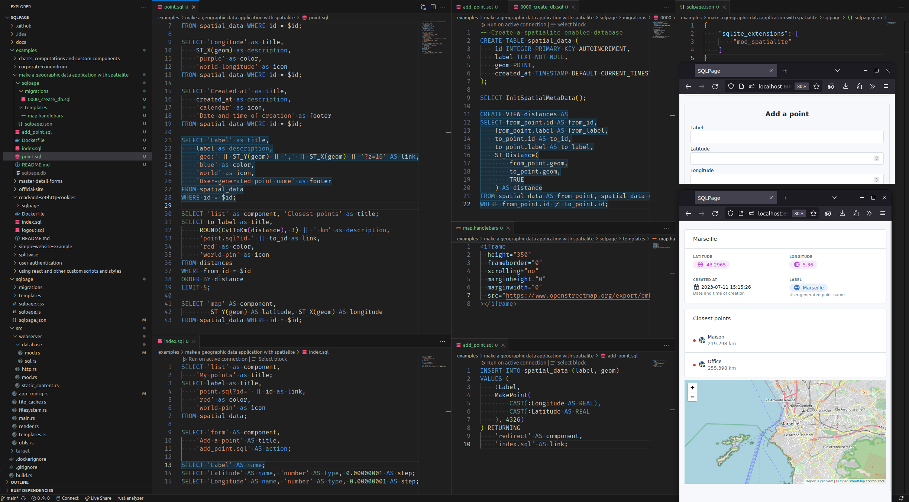

# Using PostGIS to build a geographic data application

## Introduction

This is a small application that uses [PostGIS](https://postgis.net/)
to save data associated to greographic coordinates.

If you are using a SQLite database instead see [this other example instead](../make%20a%20geographic%20data%20application%20using%20sqlite%20extensions/),
which implements the same application using the `spatialite` extension.

### Installation

You need to install the `postgis` extension for postgres. Follow [the official instructions](https://postgis.net/documentation/getting_started/).

Then you can instruct SQLPage to connect to your database by editing the [`sqlpage/sqlpage.json`](./sqlpage/sqlpage.json) file.

## Screenshots

