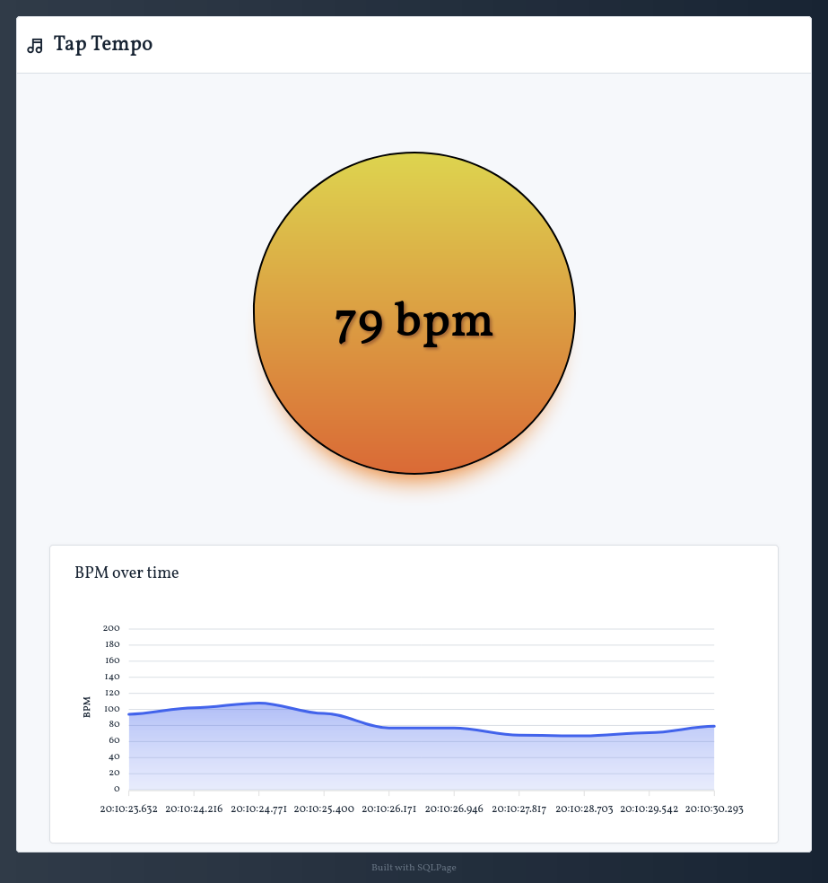

# TapTempo

This small SQLPage example shows how to : 
 - save request logs to the database
 - display graphs
 - make computations on the database
 - write a custom component with HTML and CSS

## TapTempo: a webapp to measure the tempo of a song

TapTempo is a webapp that lets you measure the tempo of a song by tapping on a button in rhythm with the music.

It is a simple example of a webapp that stores data in a database, and displays graphs.

### Implementation

At each tap, the webapp sends a request to the server, which stores the timestamp of the tap in the `tap` table.

A [window function](https://www.sqlite.org/windowfunctions.html) is used to compute the tempo of the song from the timestamps of the last two taps.

