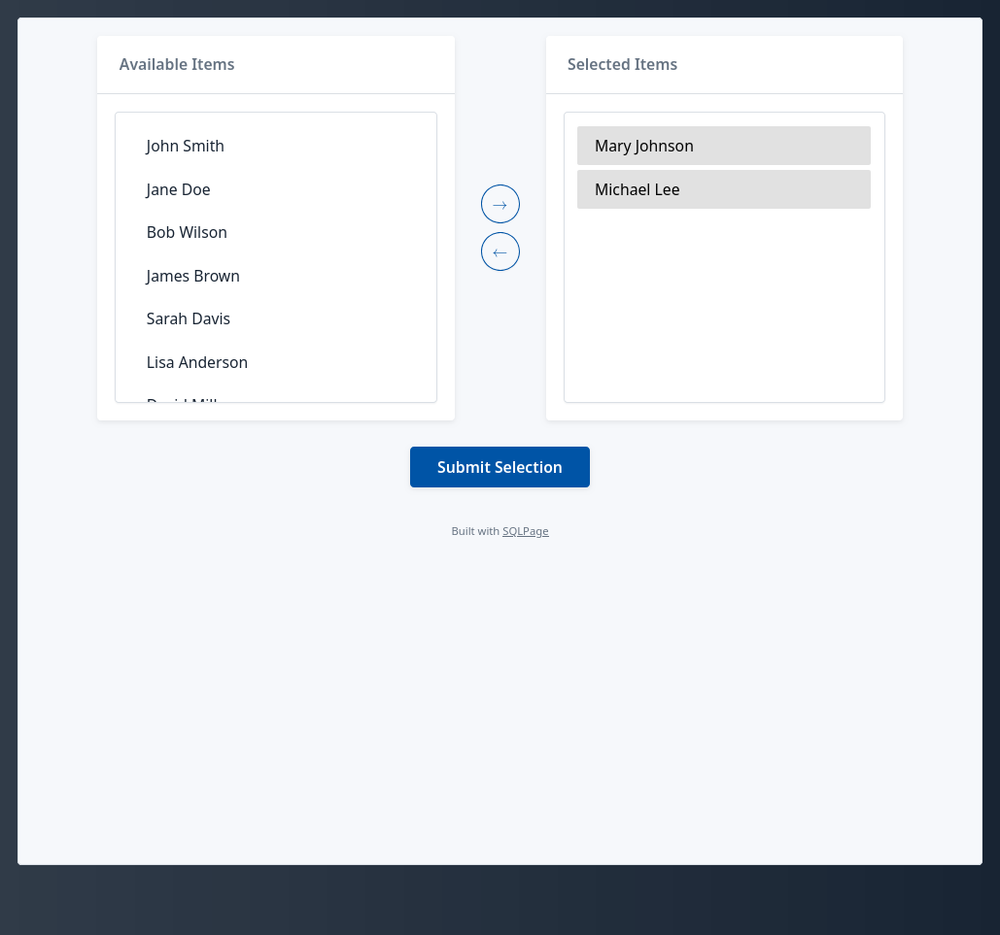

# Custom form component

This example shows how to create a simple custom component in handlebars, and use from SQL.

It uses MySQL, but does not use any MySQL-specific features, so it should be easy to adapt to other databases.

## Key features illustrated in this example

- How to create a custom component in handlebars, with dynamic behavior implemented in JavaScript
- How to manage multiple-option select boxes, with pre-selected items, and multiple choices
- Including a common menu between different pages using a `shell.sql` file, the dynamic component, and the `sqlpage.run_sql` function.