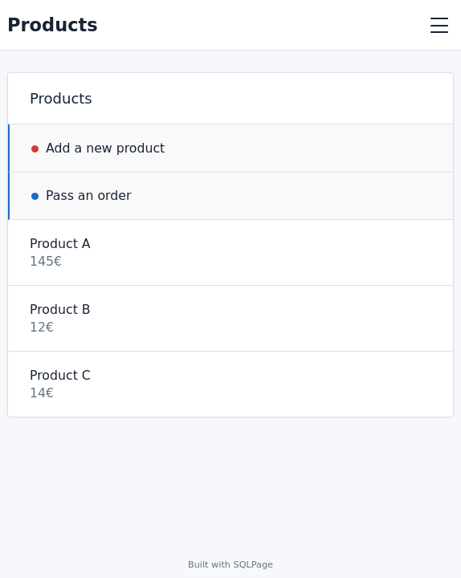
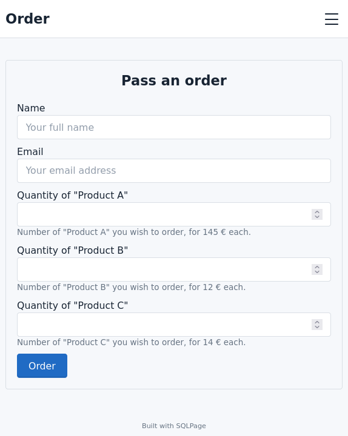
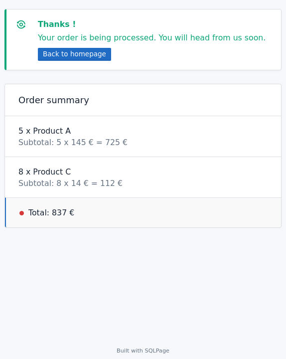

# Handling forms with a variable number of fields

This example shows how to handle forms with a number of fields
that is not known in advance, but depends on the contents of the database.

## The model

We have a database with a table
`products` that contains the products,
a table `orders` that contains the orders,
and a table `order_items` that contains the items of each order.

We want to display a form to create a new order, with a field for each product.

We cannot know in advance how many products there are,
so we cannot write a simple insert statement for `orders_items`,
like

```sql
INSERT INTO order_items (product_id, quantity)
VALUES (:product_1, :product_1_quantity);
```

Instead, we use a single POST variable of type array to store the
product IDs and quantities, like so:

```sql
SELECT 
    'product_quantity[]'   AS name,
    'Quantity of ' || name AS label
FROM products
```

And then we parse the array in SQLite with the [JSON_EACH](https://www.sqlite.org/json1.html#jeach) function.

## Screenshots



