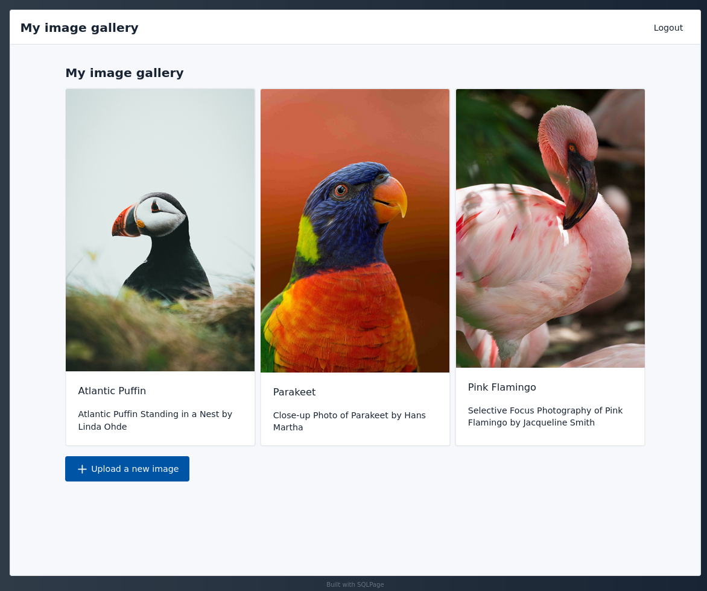
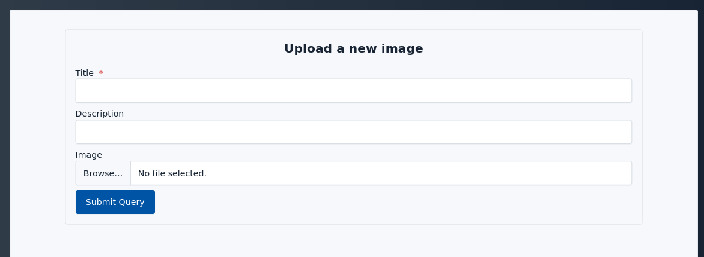
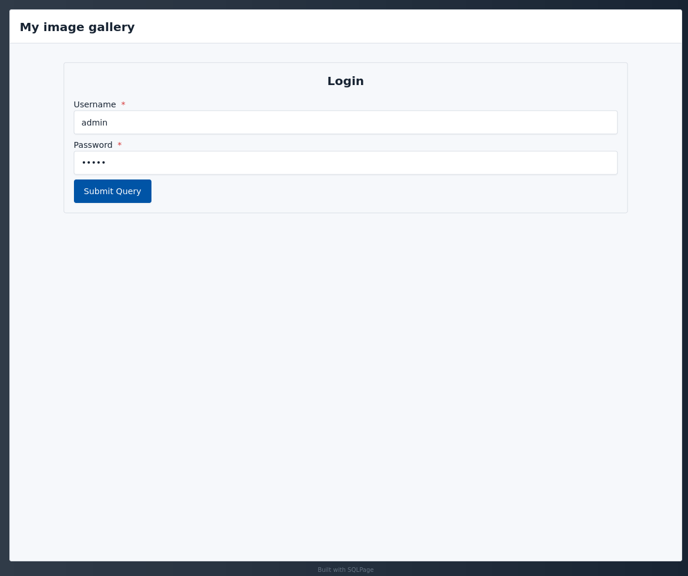

# Image gallery

This example shows how to create an image gallery with user uploads.

Users can log in (default login is `admin`/`admin`) and upload images.
Uploaded images are stored in the database as data urls.
Using data urls allows us to store the images in the database, without having to set up a separate file server,
which is the simplest way to get started. However, this is not a good idea if you want to store large images,
as data urls are not very efficient, and will need to be transferred in full from the database to sqlpage to the user's browser. One can use `sqlpage.exec` to move the images to a separate file server, and store only the file urls in the database.

