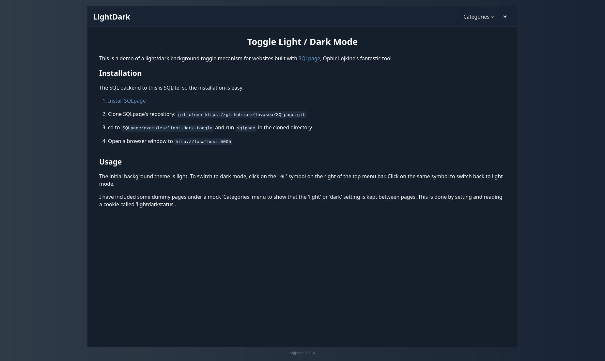

# Switching between light mode and dark mode in SQLPage

This is a demo of a light/dark background toggle mecanism for websites built with [SQLpage](https://sql-page.com/).

This example demonstrates:
 - how to give the same header, footer, and style to all your pages using the `dynamic` component and the `run_sql` function.
 - how to use the `theme` property of the `shell` component.
 - how to store and reuse persistent user-specific preferences using cookies.

## Installation

The SQL backend to this is SQLite, so the installation is easy:

1. [Install SQLpage](https://sql-page.com/your-first-sql-website/)

1. Clone SQLpage''s repository: `git clone https://github.com/lovasoa/SQLpage.git`

1. cd to `SQLpage/examples/light-dark-toggle` and run `sqlpage` in the cloned directory

1. Open a browser window to `http://localhost:5005`

## Usage

The initial background theme is light. To switch to dark mode, click on the '' ☀ '' symbol on the right of the top menu bar. Click on the same symbol to switch back to light mode.

I have included some dummy pages under a mock ''Categories'' menu to show that the ''light'' or ''dark'' setting is kept between pages. This is done by setting and reading a cookie called ''lightdarkstatus''.' AS contents_md;
