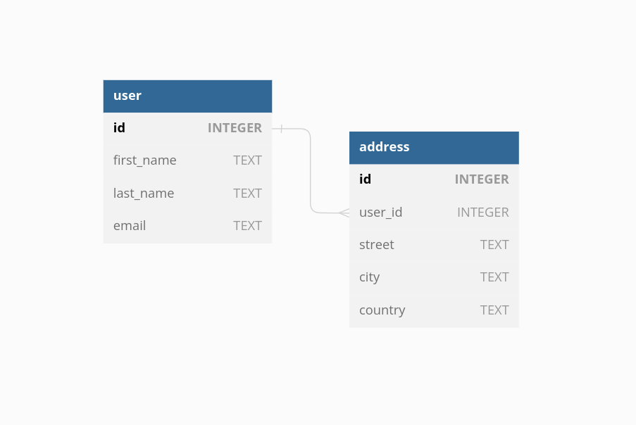
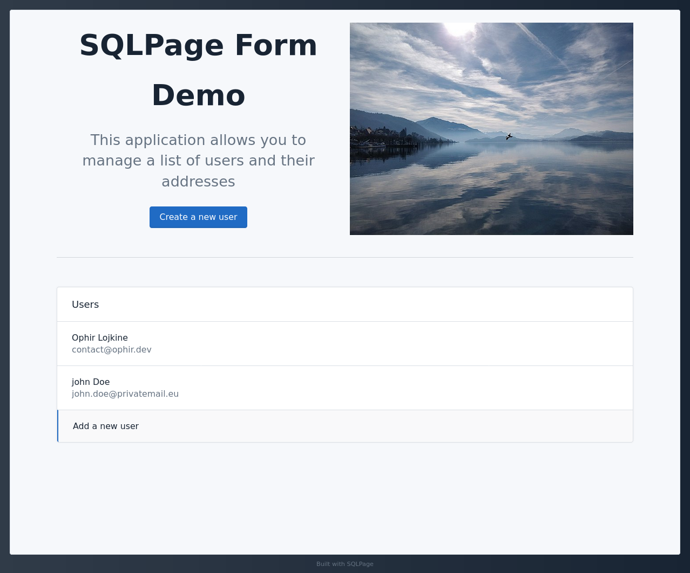

# Master-Detail Forms (Nested Forms)

This example shows how to handle inserting data into multiple tables
with a one-to-many relationship.

The example uses a **SQLite** database with the following schema:

| Database Schema | SQLPage Form |
| --- | --- |
|  |  |

A single master page features two forms based on two related tables or views.
Users insert data in the master form first to update information from the parent table.
Then, they can insert data in the detail forms to update information from the child tables.

This example application contains a main form to create users,
and a second form to create their addresses.

Once a user has been added, multiple addresses can be added to it.

See https://github.com/lovasoa/SQLpage/discussions/16 for more details.

The main idea is to create two separate forms.
In this example, we put both forms on the same page, in [`edit-user.sql`](./edit-user.sql).
The first one is an edition form for the already-existing user record,
and the second is a form to add an address to the user.

When you initially load the user creation form,
we do not display the address form.
Only when the user has been created,
you are redirected to the user edition form that contains the address form.

## Screenshots

