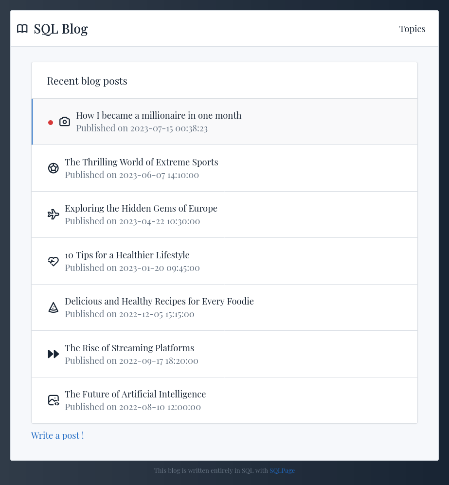
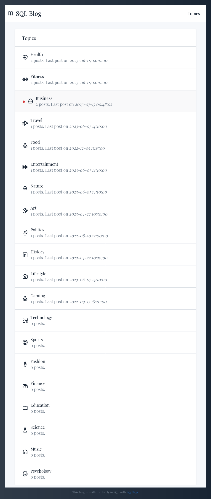
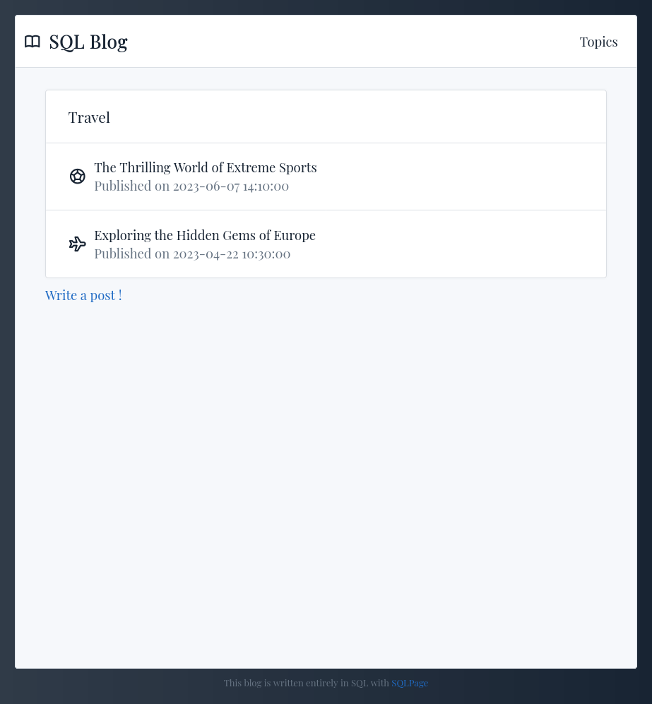
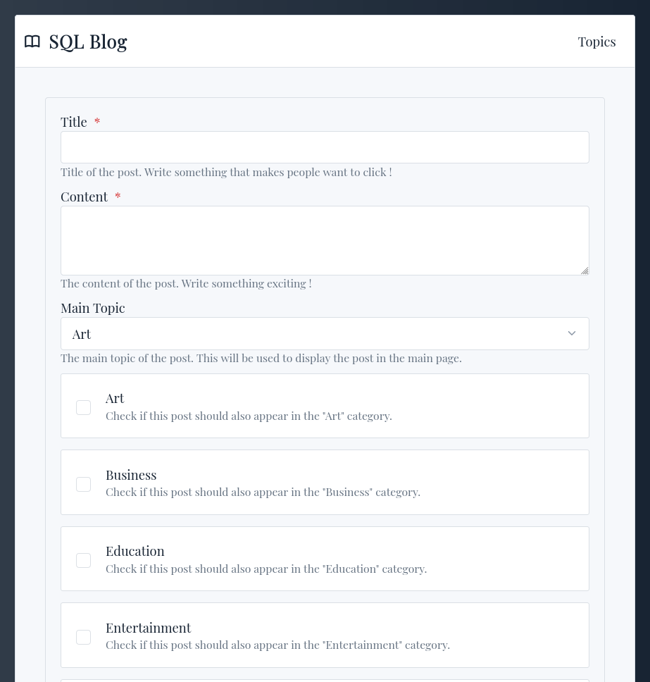

# A simple blog with topics and posts

Users can create topics and posts. A topic can have many posts and a post can have many topics.

See 
 - [`write.sql`](./write.sql) for the form definition,
 - [`write_submit.sql`](./write_submit.sql) for the database insertion code.

