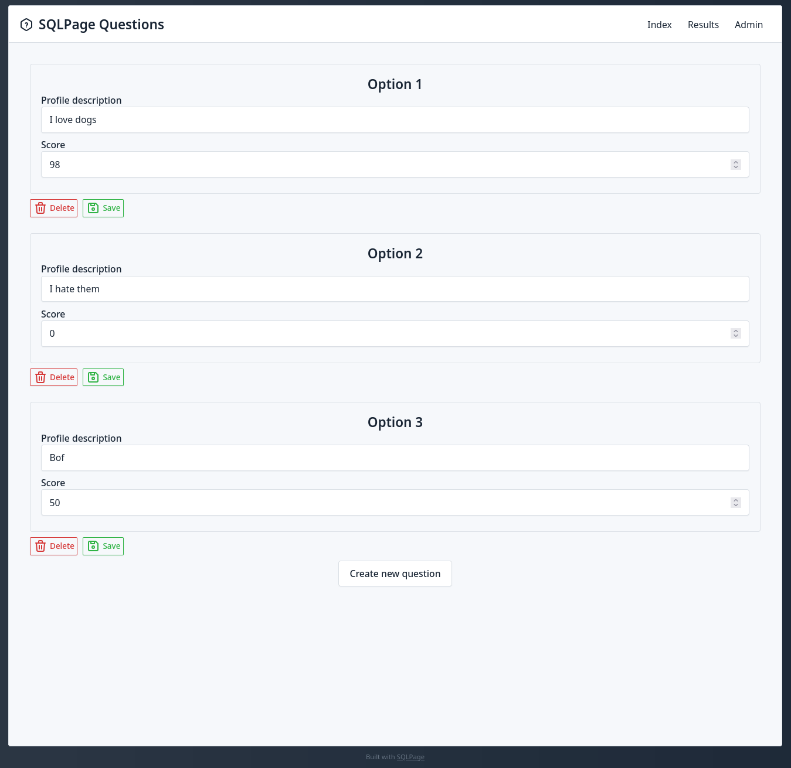

# SQLPage multiple choice question example

This is a very simple example of a website that stores a list of 
possible answers to a multiple choice question in a database table,
and then displays the question and the possible answers to the user.

When the user selects an answer, the website will save the user's
choice in the database and display other users' choices as well.

## Screenshots

| Question answering form | Results table | Question edition |
| --- | --- | --- |
|  |  |  |

## How to run

Just run the sqlpage binary (`./sqlpage.bin`) from this folder.

## Interesting files

[admin.sql](admin.sql) uses the [dynamic component](https://sql.ophir.dev/documentation.sql?component=dynamic#component) to create a single page with one form per MCQ option.

[website_header.json](website_header.json) contains the [shell](https://sql.ophir.dev/documentation.sql?component=shell#component) that is then used in all pages using the `dynamic` component to create a consistent look and feel between pages.