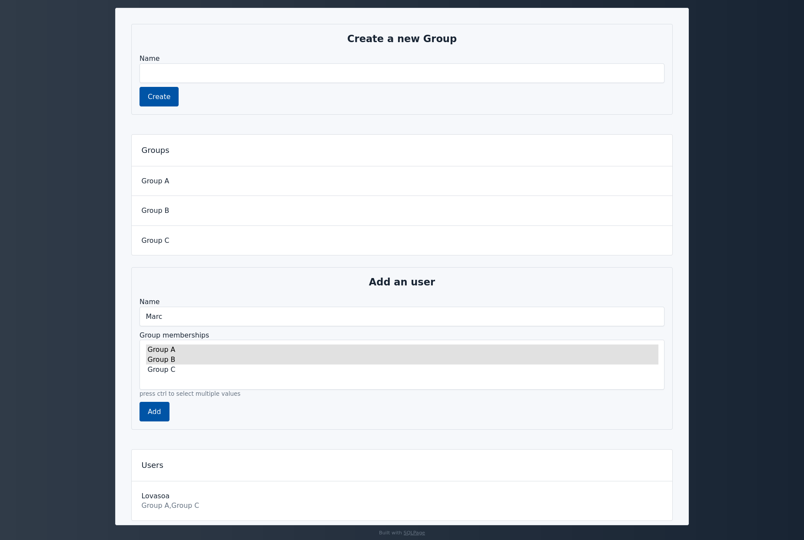

# Handling json data in MySQL

This demonstrates both how to produce json data from a SQL query in MySQL
and how to consume json data from SQLPage.

## Documentation

This example demonstrates how to consume [JSON](https://en.wikipedia.org/wiki/JSON) data from a MySQL database,
using the [`JSON_TABLE`](https://dev.mysql.com/doc/refman/8.0/en/json-table-functions.html)
function to parse the JSON data into a table.

The main page contains a form with a select input, in which the user can
select one or multiple values.

The values are then sent to the server, and are accessible from SQL queries in the form of a JSON array.

The SQL then uses the `JSON_TABLE` function to transform the JSON array into a temporary table,
which is then used to process the data and insert it into the database.