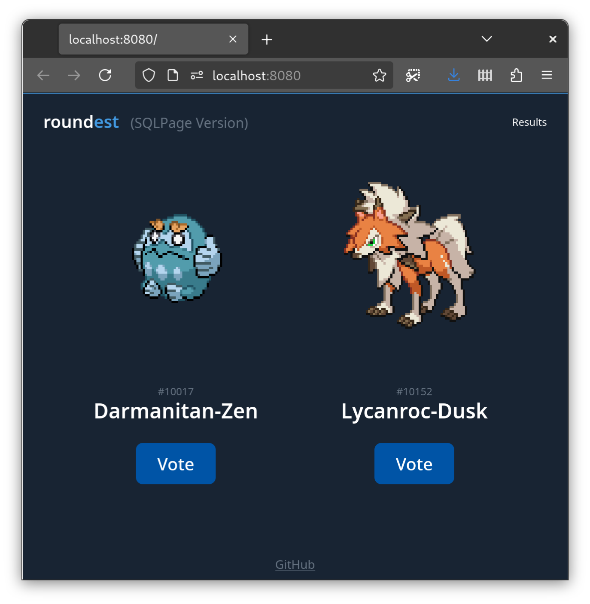
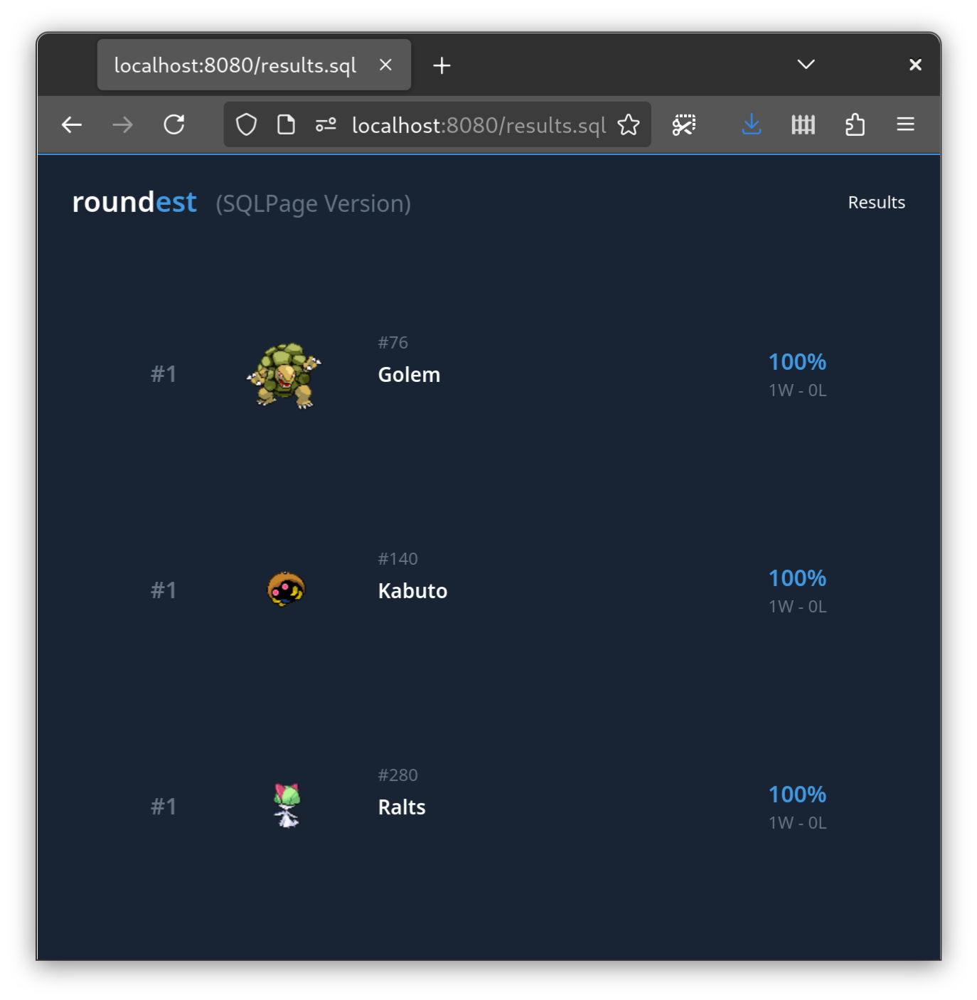

# Roundest (SQLPage Version)

This is a simple web app that allows you to vote on which Pokemon is the most round.

| Vote UI | Results UI |
| --- | --- |
|  |  |

It demonstrates how to build an entirely custom web app,
without using any of the pre-built components of SQLPage.

All the custom components are in the [`sqlpage/templates/`](./sqlpage/templates/) folder.

## Running the app

### Using an installed version of SQLPage

```
sqlpage --web-root src
```

### Using Docker

```
docker build -t roundest-sqlpage .
docker run -p 8080:8080 -it roundest-sqlpage
```
