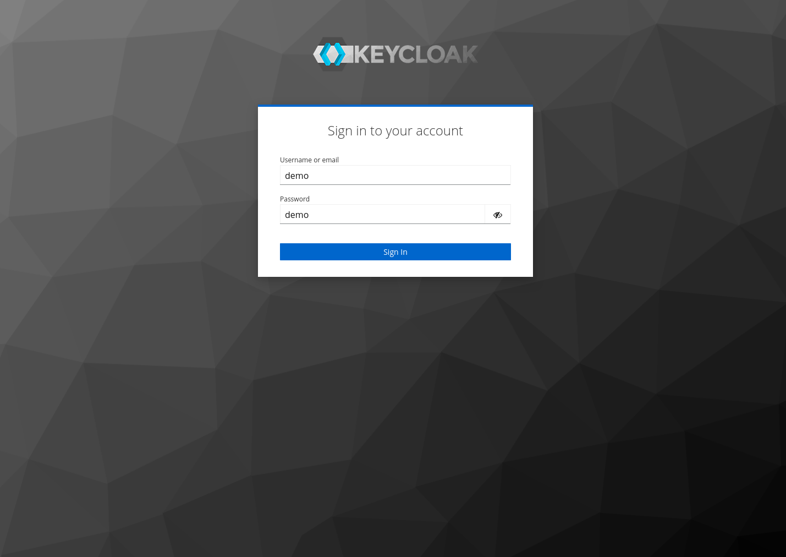
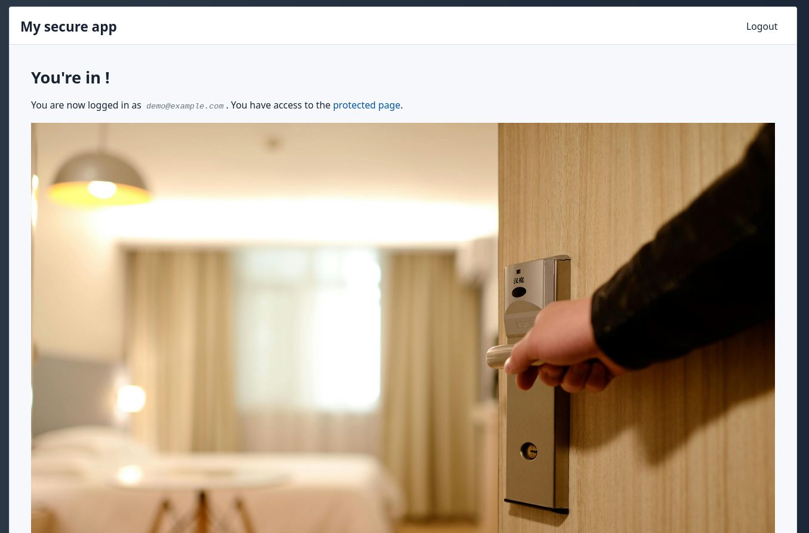

# SQLPage OIDC Implementation Demo

This project demonstrates how to implement OpenID Connect (OIDC) authentication in a SQLPage application.

OIDC is an authentication protocol that allows users to authenticate with a third-party identity provider and then access applications without having to log in again. This is useful for single sign-on (SSO) scenarios where users need to access multiple applications with a single set of credentials.
OIDC can be used to implement a "Login with Google" or "Login with Facebook" button in your application, since these providers support the OIDC protocol.

SQLPage currently doesn't have a native OIDC implementation, but you can implement OIDC authentication in your SQLPage app yourself.

This project provides a basic implementation of OIDC authentication in a SQLPage application. It uses the free and open source [Keycloak](https://www.keycloak.org/) OIDC provider
to authenticate users. You can easily replace Keycloak with another OIDC provider, such as Google, or your enterprise OIDC provider, by following the steps in the [Configuration](#configuration) section.


## Screenshots

| Home Page | Login Page | User Info |
| --- | --- | --- |
|  |  |  |

## Running the Demo

To run the demo, you just need docker and docker-compose installed on your machine. Then, run the following commands:

```bash
docker-compose up
```

This will start a Keycloak server and a SQLPage server. You can access the SQLPage application at http://localhost:8080.

The credentials for the demo are:
 - **Username: `demo`**
 - **Password: `demo`**

The credentials to the keycloak admin console accessible at http://localhost:8180 are `admin/admin`.

## Configuration

If you want to use this implementation in your own SQLPage application, 
with a different OIDC provider, here are the steps you need to follow:

1. Create an OIDC application in your OIDC provider (e.g., Keycloak). You will need to provide the following information:
 - **Client type** (`public` or `confidential`). For this implementation, you should use `confidential` (sometimes called `regular web application:`, `server-side`, `backend`, or `Authorization Code Flow`). In Keycloak, this is set by switching on the `Client Authentication` toggle.
 - **Client ID**: This is a unique identifier for your application. Choose a short and descriptive name for your application without spaces or special characters.
 - **Redirect URI**: This is the URL of your SQLPage application, followed by `/oidc_redirect_handler.sql`. For example, `https://example.com/oidc_redirect_handler.sql`.
 - **Logout redirect URI**: This is the URL where the user should be redirected after logging out. For this implementation, we use the home page URL: `https://example.com/`.

2. Once the application is created, the provider will give you the following information:
 - **Client secret**: This is a secret key that is used to authenticate your application with the OIDC provider. You will need to provide this value to your SQLPage application as an environment variable.


3. Once you have the client ID and client secret, you can configure your SQLPage application to use OIDC authentication. You will need to set the following [environment variables](https://en.wikipedia.org/wiki/Environment_variable) in your SQLPage application:

- `OIDC_CLIENT_ID`: The value you chose for the client ID of your OIDC application.
- `OIDC_CLIENT_SECRET`: The client secret of your OIDC application that you received from the OIDC provider in step 2.
- `OIDC_AUTHORIZATION_ENDPOINT`: The authorization endpoint of your OIDC provider. This is the URL where the user is redirected to log in. For Keycloak, this is usually `your-keycloak-url/auth/realms/master/protocol/openid-connect/auth`. For Google, this is `https://accounts.google.com/o/oauth2/auth`.
- `OIDC_TOKEN_ENDPOINT`: The token endpoint of your OIDC provider. This is the URL where the application exchanges the authorization code for an access token. For Keycloak, this is usually `your-keycloak-url/auth/realms/master/protocol/openid-connect/token`. For Google, this is `https://oauth2.googleapis.com/token`.
- `OIDC_USERINFO_ENDPOINT`: The userinfo endpoint of your OIDC provider. This is the URL where the application can retrieve information about the authenticated user. For Keycloak, this is usually `your-keycloak-url/auth/realms/master/protocol/openid-connect/userinfo`. For Google, this is `https://openidconnect.googleapis.com/v1/userinfo`.
- `OIDC_END_SESSION_ENDPOINT`: The logout endpoint of your OIDC provider. This is the URL where the application can redirect the user to log out. For Keycloak, this is usually `your-keycloak-url/auth/realms/master/protocol/openid-connect/logout`.

In order to find the various endpoints for your OIDC provider, you can refer to the OIDC provider's **Discovery Document**, at the URL `base-url/.well-known/openid-configuration`.

Here is a screenshot of the Keycloak configuration for the demo application:


## Code Overview

### `login.sql`

The [`login.sql`](./login.sql) file simply redirects the user to the OIDC provider's authorization endpoint.
The provider is then responsible for authenticating the user and redirecting them back to the SQLPage application's `oidc_redirect_handler.sql` script.

### `oidc_redirect_handler.sql`
The main logic is contained in the [`oidc_redirect_handler.sql`](./oidc_redirect_handler.sql)
file. This script handles the OIDC redirect after the user has authenticated with the OIDC provider. It performs the following steps:

1. Checks if the `oauth_state` cookie matches the `state` parameter in the query string. This is a security measure to prevent CSRF attacks. If the states do not match, the user is redirected to the login page.

2. Exchanges the authorization code for an access token. This is done by making a POST request to the OIDC provider's token endpoint. The request includes the authorization code, the redirect URI, and the client ID and secret.

3. If the access token cannot be obtained, the user is redirected to the login page.

### `logout.sql`

The [`logout.sql`](./logout.sql) file simply clears the `session_id` cookie,
removes the session information from the database, and redirects the user to the OIDC provider's logout endpoint.

## References

- An accessible explanation of OIDC: https://annotate.dev/p/hello-world/learn-oauth-2-0-by-building-your-own-oauth-client-U2HaZNtvQojn4F
- [OpenID Connect](https://openid.net/connect/)
- [Authorization Code Flow](https://openid.net/specs/openid-connect-core-1_0.html#CodeFlowAuth)

