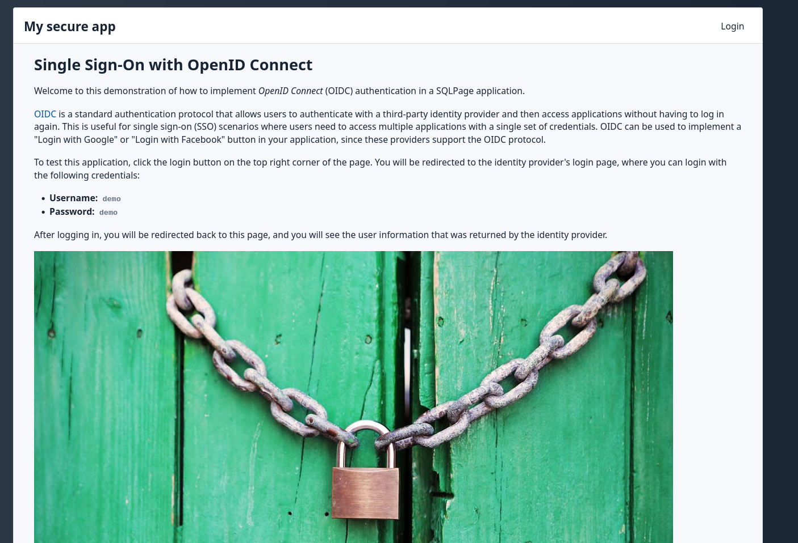

# SQLPage Single Sign-On demo

This project demonstrates how to implement 
external authentication (Single Sign-On) in a SQLPage application using SQLPage's built-in OIDC support.

It demonstrates the implementation of two external authentication protocols:
- [OpenID Connect (OIDC)](https://openid.net/connect/)
- [Central Authentication Service (CAS)](https://apereo.github.io/cas/)

Depending on your use case, you can choose the appropriate protocol for your application.

## Screenshots

| Home Page | Login Page | User Info |
| --- | --- | --- |
|  |  |  |

## Running the Demo

To run the demo, you just need docker and docker-compose installed on your machine. Then, run the following commands:

```bash
docker-compose up
```

This will start a Keycloak server and a SQLPage server. You can access the SQLPage application at http://localhost:8080.

The credentials for the demo are:
 - **Username: `demo`**
 - **Password: `demo`**

The credentials to the keycloak admin console accessible at http://localhost:8180 are `admin/admin`.

## CAS Client

This example also contains a CAS (Central Authentication Service) client
in the [`cas`](./cas) directory that demonstrates how to authenticate users using
the [CAS protocol](https://apereo.github.io/cas/) (version 3.0), which is mostly used in academic institutions.

## OIDC Client

OIDC is an authentication protocol that allows users to authenticate with a third-party identity provider and then access applications without having to log in again. This is useful for single sign-on (SSO) scenarios where users need to access multiple applications with a single set of credentials.
OIDC can be used to implement a "Login with Google" or "Login with Facebook" button in your application, since these providers support the OIDC protocol.

SQLPage has built-in support for OIDC authentication since v0.35.
This project demonstrates how to use it with the free and open source [Keycloak](https://www.keycloak.org/) OIDC provider.
You can easily replace Keycloak with another OIDC provider, such as Google, or your enterprise OIDC provider, by following the steps in the [Configuration](#configuration) section.

### Important Note About OIDC Protection

When using SQLPage's built-in OIDC support, the entire website is protected behind authentication. This means:
- All pages require users to be logged in
- There is no way to have public pages alongside protected pages
- Users will be automatically redirected to the OIDC provider's login page when accessing any page

If you need to have a mix of public and protected pages, you should use the [authentication component](/component.sql?component=authentication) instead.

### Configuration

To use OIDC authentication in your own SQLPage application, 
you need to configure it in your `sqlpage.json` file:

```json
{
  "oidc_issuer_url": "https://your-keycloak-server/auth/realms/your-realm",
  "oidc_client_id": "your-client-id",
  "oidc_client_secret": "your-client-secret",
  "host": "localhost:8080"
}
```

The configuration parameters are:
- `oidc_issuer_url`: The base URL of your OIDC provider
- `oidc_client_id`: The ID that identifies your SQLPage application to the OIDC provider
- `oidc_client_secret`: The secret key for your SQLPage application
- `host`: The web address where your application is accessible

### Accessing User Information

Once OIDC is configured, you can access information about the authenticated user in your SQL files using these functions:

- `sqlpage.user_info(claim_name)`: Get a specific claim about the user (like name or email)
- `sqlpage.user_info_token()`: Get the entire identity token as JSON

Example:
```sql
select 'text' as component, 'Welcome, ' || sqlpage.user_info('name') || '!' as contents_md;
```

### Implementation Details

The demo includes several SQL files that demonstrate different aspects of OIDC integration:

1. `index.sql`: Shows how to:
   - Display user information using `sqlpage.user_info('email')`
   - Show all available user information using `sqlpage.id_token()`

2. `protected.sql`: Demonstrates a page that is accessible to authenticated users

3. `logout.sql`: Shows how to:
   - Remove the authentication cookie
   - Redirect to the OIDC provider's logout endpoint

### Docker Setup

The demo uses Docker Compose to set up both SQLPage and Keycloak. The configuration includes:

- SQLPage service with:
  - Volume mounts for the web root and configuration
  - CAS configuration for optional CAS support
  - Debug logging enabled

- Keycloak service with:
  - Pre-configured realm and users
  - Health checks to ensure it's ready before SQLPage starts
  - Admin credentials for management

## References

- [SQLPage OIDC Documentation](https://sql-page.com/sso)
- [OpenID Connect](https://openid.net/connect/)
- [Authorization Code Flow](https://openid.net/specs/openid-connect-core-1_0.html#CodeFlowAuth)

