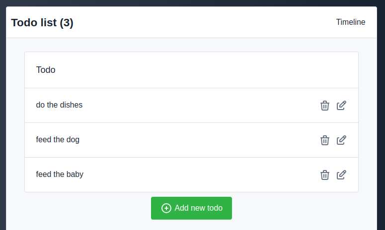

# Todo app with SQLPage

This is a simple todo app implemented with SQLPage. It uses a SQLite database to store the todo items.

It is meant as an illustrative example of how to use SQLPage to create a simple CRUD application.

## Structure

### [`index.sql`](./index.sql)

This is the main file of the application.
It will be loaded when the user visits the root of the application
(`http://localhost:8080/` when running this example locally).

In order, it uses:
 - the [`dynamic`](https://sql.ophir.dev/documentation.sql?component=dynamic#component) component to load the [`shell.sql`](#shellsql) file that will be used at the top of every page
in the application to create a consistent layout and top bar.
 - the [`list`](https://sql.ophir.dev/documentation.sql?component=list#component) component to display the list of todo items.
 - the [`button`](https://sql.ophir.dev/documentation.sql?component=button#component) component to create a button that will redirect the user to the [`todo_form.sql`](#todo_formsql) page to create a new todo item when clicked.

### [`todo_form.sql`](./todo_form.sql)

This file is used to create a new todo item or edit an existing one.

It uses:
 1. the [`redirect`](https://sql.ophir.dev/documentation.sql?component=redirect#component) component to redirect the user back to the [`index.sql`](#indexsql) page after the form is submitted.
 1. the [`dynamic`](https://sql.ophir.dev/documentation.sql?component=dynamic#component) component to load [`shell.sql`](#shellsql) to create a consistent layout and top bar.
 1. the [`form`](https://sql.ophir.dev/documentation.sql?component=form#component) component to create a form with fields for the title and description of the todo item.

 The order of the components is important, as the `redirect` component cannot be used after the page has been displayed. It is called first to ensure that the user is redirected immediately after submitting the form. It is guarded by a `WHERE :todo_id IS NOT NULL` clause to ensure that it only redirects when 
 the form was submitted, not when the page is
 initially loaded by the user in their browser.

### [`delete.sql`](./delete.sql)

This file is used to delete a todo item.

It contains a delete statement guarded by a
`WHERE $confirm = 'yes'` clause.
So, the delete is not executed when the page
is initially loaded, but only when the user
clicks the "Yes" button, which contains a link 
pointing to the same page with the `confirm=yes` query parameter.

The detailed step by step explanation of the delete process is as follows:
 
 - From the `index.sql` page, the user clicks the 'Delete' button on a todo item
 - It loads the page `/delete.sql?todo_id=7` (without the `confirm=yes` parameter)
   -  the delete statement **is** sent to the database and executed. SQLPage has bound the values to URL query parameters, so we have
       -  `$todo_id` bound to `'7'`, and
       -  `$confirm` bound to `NULL` (since there was no `confirm` parameter in the url)
    - the database evaluates the `where id = $todo_id and $confirm = 'yes'` condition to FALSE
    - so it deletes nothing, and returns nothing
    - SQLPage receives no row back from the database, it continues processing normally
    - it executes the `select 'dynamic' ...` query, which itself requires executing the `shell.sql` file. The result of this is a row that contains `component=dynamic` and `properties={"component": "shell", "title": "My Todo App", ... }`
    - it renders the page header with the application header and the top bar following the results of the query
    - it sends to the database the last query: `select 'alert' as component,  ... from todos where id = $todo_id` it binds the parameters like before
       -  `$todo_id` bound to `'7'`
    - the database returns a single row, containing `component=alert`, `description_md=Are you sure [...] [the title of the todo item with id 7]`, ...
    - SQLPage returns the the `alert` component with its contents to the browser
 - The user sees the confirmation alert and clicks the 'Delete' button
 - The page is reloaded, this time with the URL `/delete.sql?todo_id=7&confirm=yes`
     -  the delete statement is sent to the database and executed like last time. But this time SQLPage has bound the values to the new URL query parameters,
         -  `$todo_id` bound to `'7'`, (like before)
         -  `$confirm` bound to `'yes'` (since there is now a `confirm` parameter in the url)
     - the database evaluates the `where id = $todo_id and $confirm = 'yes'` condition to TRUE
     - so it deletes the todo item with id 7 and, as instructed by the `returning` clause, returns a single row containing `component=redirect`, `link=/`
    - SQLPage receives the row back from the database, and immediately returns sends a 302 redirect response to the browser, redirecting the user to the `/` page.
    - The following queries are not executed, as the page is redirected before they are processed.

### [`shell.sql`](./shell.sql)

This file is not meant to be accessed directly by the user (it would display an empty page with only the top bar).

But it is included from all the other pages to
call the [`shell`](https://sql.ophir.dev/documentation.sql?component=shell#component) component with the exact same parameters on every page.

It is included everywhere using the [`dynamic`](https://sql.ophir.dev/documentation.sql?component=dynamic#component) component and the [`sqlpage.run_sql`](https://sql.ophir.dev/functions.sql?function=run_sql#function) function.

## Running the example

To run the example, simply [download the latest SQLPage release](https://github.com/lovasoa/SQLpage/releases) and run it from the root folder of the example.

## SQLPage features used

This example is meant to illustrate many
of the common features of SQLPage.

### Components

 - [list](https://sql.ophir.dev/documentation.sql?component=list#component)
 - [button](https://sql.ophir.dev/documentation.sql?component=button#component)
 - [form](https://sql.ophir.dev/documentation.sql?component=form#component)
 - [redirect](https://sql.ophir.dev/documentation.sql?component=redirect#component)
 - [shell](https://sql.ophir.dev/documentation.sql?component=shell#component)
 - [timeline](https://sql.ophir.dev/documentation.sql?component=timeline#component)
 - [dynamic](https://sql.ophir.dev/documentation.sql?component=timeline#component)

### Functions

 - [sqlpage.run_sql](https://sql.ophir.dev/functions.sql?function=run_sql#function)
