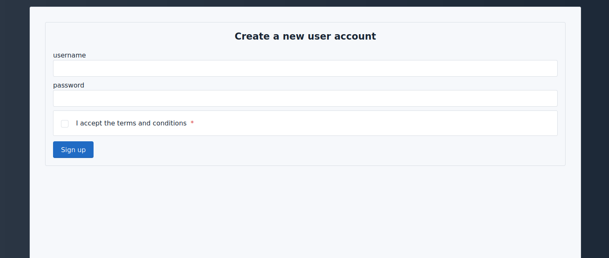
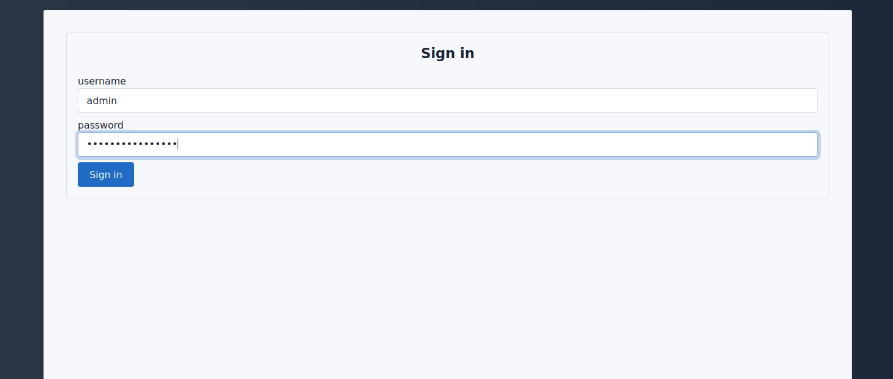
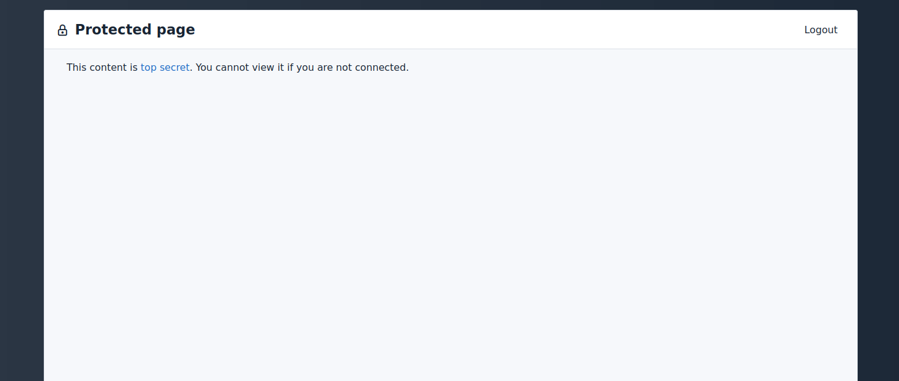

# User authentication demo

This example demonstrates how to manually handle user authentication with SQLpage and PostgreSQL.
All the user and password management is done in the database, using the standard [pgcrypto](https://www.postgresql.org/docs/current/pgcrypto.html) postgresql extension.

This demonstrates how to implement:
 - [a signup form](./sign%20up.sql)
 - [a login form](./sign%20in.sql)
 - [a logout button](./logout.sql)
 - [secured pages](./protected_page.sql) that can only be accessed by logged-in users

User authentication is a complex topic, and you can follow the work on implementing differenet authentication methods in [this issue](https://github.com/lovasoa/SQLpage/issues/12).

## Caveats

In this example, we store encrypted user passwords in the database, but we let the database itself handle the encryption.
For that to be safe, you need to make sure that:
 - the database is not accessible by untrusted users
 - the database logs and configuration files are not accessible by untrusted users
 - your connection to the database is encrypted [(use SSL)](https://www.postgresql.org/docs/current/ssl-tcp.html). It should be the case by default if you use a recent version of PostgreSQL and a popular distribution.

## Screenshots

| Signup form | Login form | Protected page |
| --- | --- | --- |
|  |  |  |
|  |  |  |

## How it works

### User creation

The [a signup form](./sign%20up.sql) is a simple form that is handled by [`create_user.sql`](./create_user.sql).
You could restrict user creation to existing administrators and create an initial administrator in a database migration.

### User login

The [a login form](./sign%20in.sql) is a simple form that is handled by [`login.sql`](./login.sql).
It checks that the username exists and that the password is correct using the [pgcrypto](https://www.postgresql.org/docs/current/pgcrypto.html) extension with

```sql
SELECT * FROM users WHERE username = :username AND password = crypt(:password, password);
```

If the login is successful, an entry is added to the [`login_session`](./sqlpage/migrations/0000_init.sql) table with a random session id.
The session id is then stored in a cookie on the user's browser.

The user is then redirected to [`./check_login.sql`](./check_login.sql) that checks that the session id is valid and redirects back to the login page if it is not.

### Protected pages

Protected pages are pages that can only be accessed by logged-in users.
There is an example in [`protected_page.sql`](./protected_page.sql) that uses a simple [postgresql stored procedure](./sqlpage/migrations/0000_init.sql)
 to raise an error (and thus prevent content rendering) if the user is not logged in.

### User logout

The cookie can be deleted in the browser by navigating to [`./logout.sql`](./logout.sql).