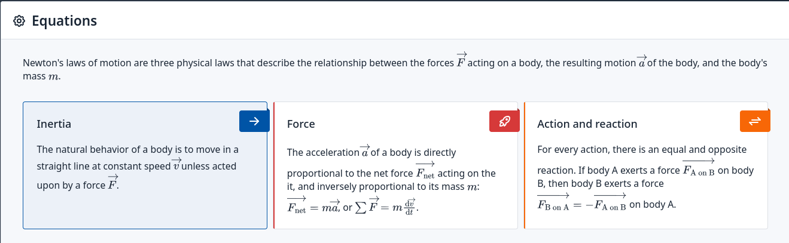

# Custom javascript and CSS

This example shows how to use custom javascript and CSS in your application.
It is compatible with SQLPage v0.7.3 and above.

It integrates a simple [react](https://reactjs.org/) component and loads it with properties coming from a SQL query.

## Screenshots

## Notes

This example relies on a CDN to load the react library, and the example component is written in plain Javscript, not JSX.

You can also use include a local copy of react, and write your components in JSX/TSX,
you will simply need to add a build step to your application to compile the JSX/TSX files into plain JS,
and then include that build result in your application.